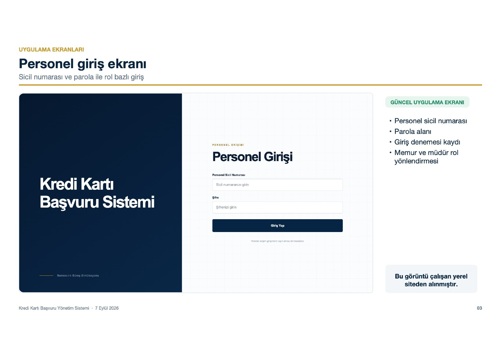
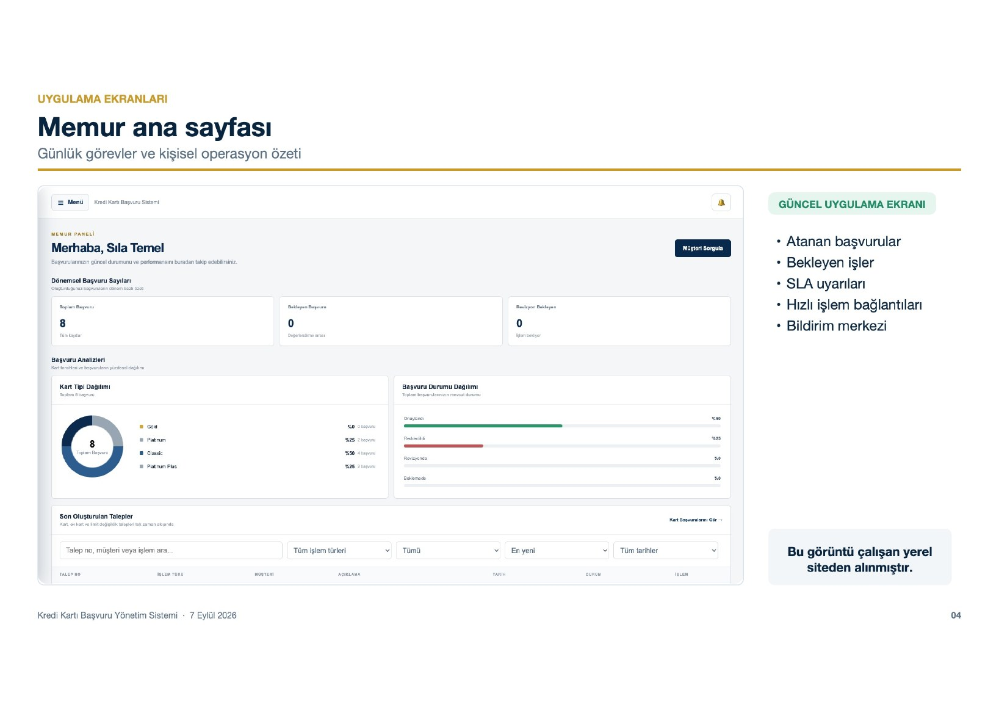
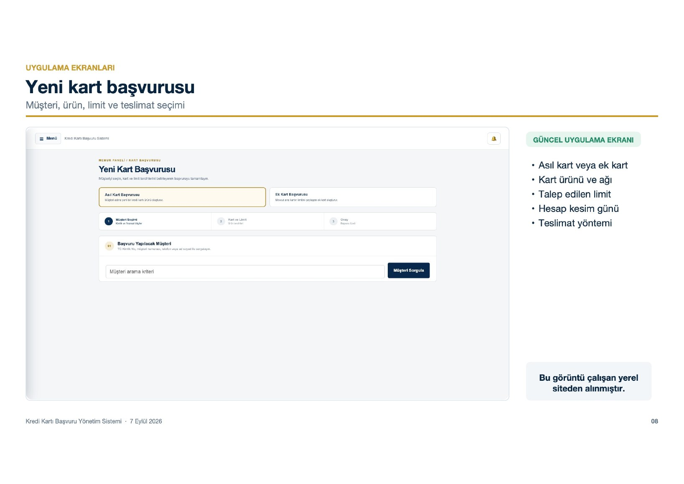
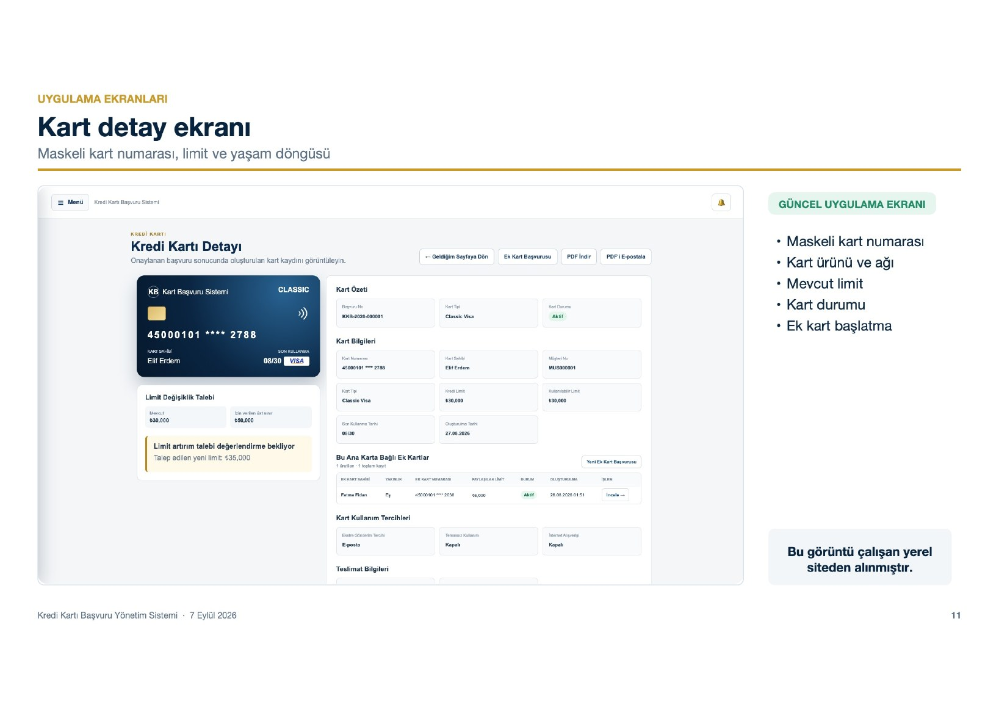
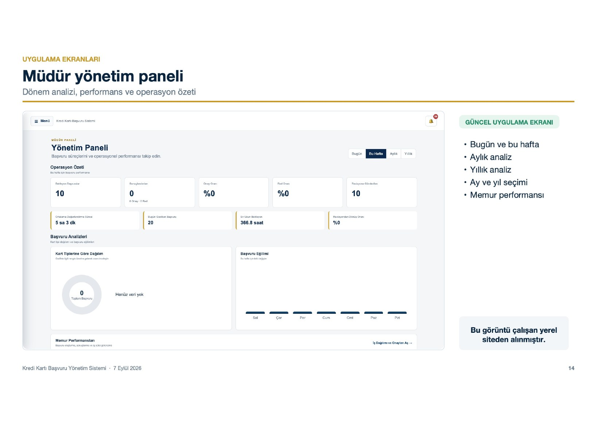
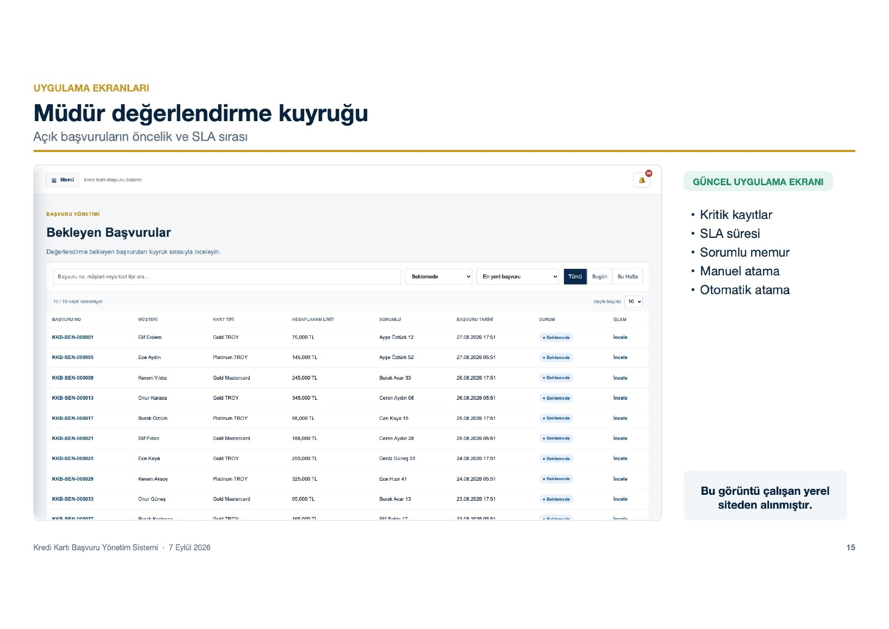
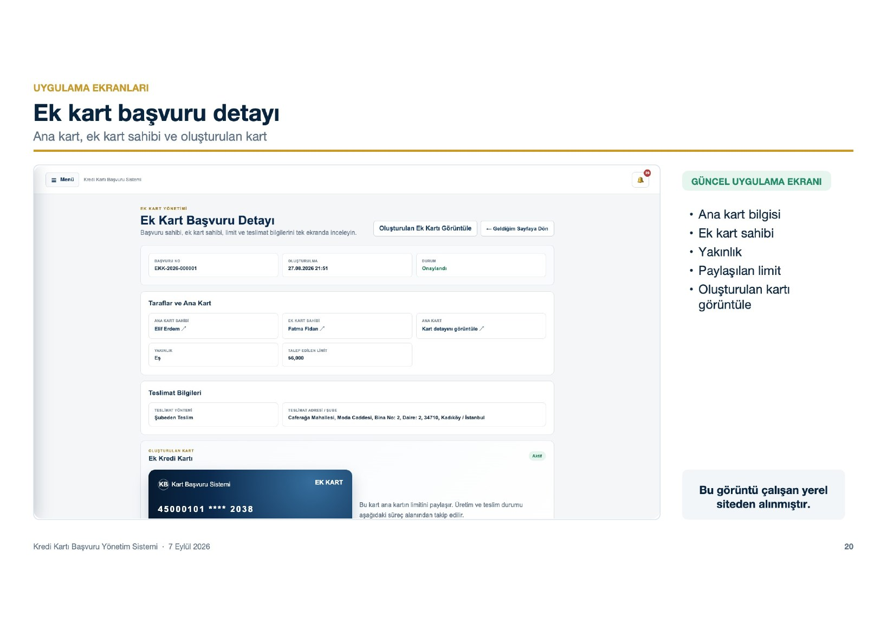

# Kredi Kartı Başvuru Yönetim Sistemi

Bu proje yaz stajım sırasında, bankadaki kredi kartı başvuru sürecini daha iyi anlamak ve örnek bir uygulama geliştirmek amacıyla hazırlandı. Uygulamada memur ve müdür için ayrı ekranlar bulunuyor. Müşteri kaydından başlayarak kart başvurusu, değerlendirme, kart oluşturma ve teslim aşamalarına kadar olan süreç takip edilebiliyor.

## Projede neler var?

- Müşteri arama, kayıt ve adres işlemleri
- Asıl kart ve ek kart başvurusu
- Belge yükleme ve başvuru özeti
- Memur ve müdür girişleri
- Başvuruya memur atama
- Müdür onay, ret ve revizyon işlemleri
- Limit artırım ve azaltım talepleri
- Kart detayları ve teslimat aşamaları
- Personel iletişim ekranı
- Yönetim panelinde günlük, haftalık, aylık ve yıllık analiz
- Müşteri portalı

## Uygulamadan ekranlar

### Personel girişi

Memur ve müdür girişleri aynı ekran üzerinden yapılır. Kullanıcının rolüne göre açılan menüler ve yetkiler değişir.



### Memur paneli ve yeni kart başvurusu

Memur ana sayfasından müşteri ve başvuru işlemlerine ulaşılabilir. Yeni kart başvurusunda müşteri, kart ürünü, limit, teslimat ve belge bilgileri adım adım alınır.





### Kart ve başvuru detayı

Başvuru geçmişi, KYC kontrolleri, kartın güncel durumu ve teslimat aşamaları aynı detay ekranından izlenebilir.



### Müdür paneli

Müdür panelinde açık ve sonuçlanmış başvurular, iş dağılımı, personel performansı ve dönemsel analizler bulunur. Değerlendirme kuyruğundaki başvurular incelenerek onay, ret veya revizyon kararı verilebilir.





### Ek kart başvurusu

Ek kart başvurusunun sahibi, limiti ve süreç bilgileri detay sayfasında gösterilir; kart oluşturulduktan sonra ilgili kart kaydına buradan ulaşılabilir.



## Kullanılan teknolojiler

- Angular 20, TypeScript ve SCSS
- ASP.NET Core 8 Web API
- Entity Framework Core
- SQLite
- JWT ve BCrypt
- xUnit

Backend tarafı API, Application, Domain ve Infrastructure katmanlarından oluşuyor. Frontend uygulaması `kart-basvuru-ui`, backend uygulaması ise `backend` klasöründe bulunuyor.

## Çalıştırma

Backend için:

```bash
cd backend
dotnet restore CreditCardApplicationSystem.sln
dotnet run --project src/CreditCardApplication.Api/CreditCardApplication.Api.csproj --launch-profile http
```

Frontend için ayrı bir terminalde:

```bash
cd kart-basvuru-ui
npm ci
npm start
```

Frontend `http://localhost:4200`, API `http://localhost:5057` adresinde çalışır.

## Demo giriş bilgileri

| Rol | Kullanıcı | Parola |
| --- | --- | --- |
| Memur | `KBP000001` | `DemoLogin01!` |
| Müdür | `KBP000002` | `DemoLogin01!` |
| Müşteri | `MUS000001` | `Musteri123!` |

Veritabanı ilk çalıştırmada örnek olarak 200 müşteri, 50 memur, 5 müdür, 200 ana kart ve 200 ek kart oluşturur. Bu kayıtlar gerçek kullanıcı bilgisi değildir.

## Test

```bash
cd backend
dotnet test CreditCardApplicationSystem.sln

cd ../kart-basvuru-ui
npm run build
npx tsc -p tsconfig.spec.json --noEmit
```

Kart numarası oluşturulurken Luhn kontrolü uygulanır. Tam kart numarası ve CVV veritabanında tutulmaz. SMS, e-posta, Findeks/KKB, kart basım ve kurye işlemleri bu projede örnek olarak çalışır.

## Dokümanlar

- [Proje sunumu](docs/presentation/Kredi_Karti_Basvuru_Yonetim_Sistemi_Proje_Sunumu_20260907_v4.pdf)
- [Test senaryoları](docs/TEST-SCENARIOS.md)
- [Veritabanı ve sunum notları](docs/DATABASE-AND-PRESENTATION-GUIDE.md)
- [Kart numarası ve Luhn notları](docs/card-number-generation.md)

## Geliştiren

Sıla Temel
